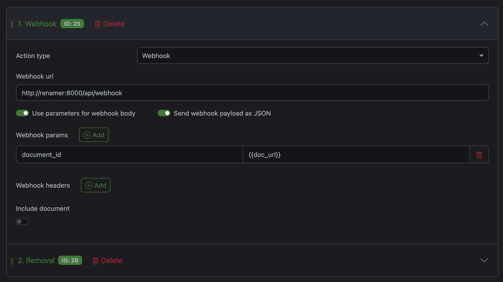

[](https://github.com/elien666/paperless-ai-renamer/actions/workflows/docker-build.yml) [](https://github.com/elien666/paperless-ai-renamer/actions/workflows/pytest.yml) [](https://github.com/elien666/paperless-ai-renamer/actions/workflows/frontend-check.yml)

# Paperless AI Renamer

A local, Dockerized AI-powered service that automatically integrates with [Paperless-ngx](https://github.com/paperless-ngx/paperless-ngx) via webhooks to rename documents using a local LLM and RAG (Retrieval Augmented Generation). A modern web UI and REST API are available to manage vector database indexing, manually scan for documents, and trigger title generation.

<video src="docs/ui-screencast.mp4" width="100%" autoplay muted loop playsinline></video>

## Features

- **Automatic Integration**: Seamlessly integrates with [Paperless-ngx](https://github.com/paperless-ngx/paperless-ngx) via webhooks - documents are automatically processed when added
- **Local LLM Integration**: Uses Ollama for intelligent title generation
- **Vision Model Support**: Automatically detects and processes image documents using vision LLMs
- **RAG-Based Learning**: Learns from your existing "good" document titles
- **Web UI**: Modern React-based interface for monitoring progress, browsing archive, managing vector DB indexing, and processing documents
- **REST API**: Full REST API for programmatic access to vector DB indexing, manual scanning, and title generation
- **Manual Controls**: Trigger scans and indexing on-demand via UI or API
- **Dry Run Mode**: Preview changes without modifying documents
- **Date Filtering**: Process documents by date range
- **Configurable Prompts**: Customize the AI's instructions
- **Language Support**: Generate titles in your preferred language (default: German)
- **Regex-Based Detection**: Flexible pattern matching for "bad" titles

## Quick Start

1. **Clone and Configure**:
   ```bash
   cd paperless-agent-rename
   ```

2. **Add to `docker-compose.yml`**:
   You can add this service to your existing Paperless `docker-compose.yml` file, or create a separate one. Update the environment variables with your actual values (see [Configuration](#configuration) for all available options):
   
   ```yaml
   services:
     renamer:
       image: ghcr.io/elien666/paperless-ai-renamer:latest
       container_name: paperless-ai-renamer
       environment:
         - PAPERLESS_API_URL=http://webserver:8000
         - PAPERLESS_API_TOKEN=your_api_token_here
         - OLLAMA_BASE_URL=http://ollama:11434
         - LLM_MODEL=llama3
         - VISION_MODEL=moondream
         - LANGUAGE=German
         - ENABLE_SCHEDULER=False
         - BAD_TITLE_REGEX=^(Scan|\d{4}[-/]\d{2}[-/]\d{2}|\d{2}[-/]\d{2}[-/]\d{4}).*
       volumes:
         - renamer_data:/app/data
       ports:
         - "8337:8000"
       restart: unless-stopped
   
     ollama:
       image: ollama/ollama:latest
       container_name: ollama
       volumes:
         - ollama_data:/root/.ollama
       environment:
         - OLLAMA_GPU_OVERHEAD=0
       restart: unless-stopped
   
   volumes:
     renamer_data:
     ollama_data:
   ```
   
   **Note**: If adding to your existing Paperless `docker-compose.yml`, make sure the `PAPERLESS_API_URL` matches your Paperless webserver service name (typically `webserver`). The `renamer` service will automatically connect to Paperless on the same Docker network.
   
   **Port Configuration**: The example uses port `8337:8000` (host:container). You can customize the host port (first number) if needed, but keep the container port as `8000`. All API examples in this README assume port `8337` on the host.

3. **Start the Services**:
   ```bash
   docker-compose up -d
   ```

4. **Pull the Required Models**:
   ```bash
   docker exec -it ollama ollama pull llama3
   docker exec -it ollama ollama pull moondream  # For image document processing
   docker exec -it ollama ollama pull chroma/all-minilm-l6-v2-f32  # For embeddings (vector search)
   ```

5. **Access the Web UI**:
   Open your browser and navigate to `http://localhost:8337` to access the web interface.

6. **Build Your Baseline** (Index existing "good" documents):
   You can do this through the web UI using the (+) Floating Action Button (FAB), or via API:
   ```bash
   curl -X POST "http://localhost:8337/index?older_than=2024-01-01"
   ```

7. **Test with a Scan**:
   You can do this through the web UI using the (+) Floating Action Button (FAB), or via API:
   ```bash
   curl -X POST "http://localhost:8337/scan?newer_than=2024-01-01"
   ```

8. **Monitor Logs**:
   ```bash
   docker-compose logs -f renamer
   ```

9. **Configure Webhook Integration** (Optional but Recommended):
   
   The service automatically integrates with [Paperless-ngx](https://github.com/paperless-ngx/paperless-ngx) via webhooks, processing documents immediately when they're added. To enable automatic processing:
   
   1. Go to Paperless Settings → **Workflows**
   2. Click **Create Workflow** to create a new workflow
   3. Configure the workflow:
      - **Sort Order**: Set to a high value (e.g., `999`) so it runs at the end
      - **Triggers**: 
        - Select **Document added** (recommended for automatic processing)
        - OR select **Document updated** (if you want to manually trigger via tag)
        - If using "Document updated", add a condition: **Tag** → **is** → `AI Rename` (or your preferred tag name)
      - **Actions**:
        - Click **Add Action** → Select **Webhook URL**
        - Enter webhook URL: `http://renamer:8000/webhook` (use the service name from your docker-compose.yml)
        - Enable **Use parameters for webhook body**
        - Enable **Send webhook payload as JSON**
        - Add webhook parameter:
          - **Parameter Name**: `webhook_id`
          - **Value**: `{{doc_url}}`
        - If you used a tag trigger (e.g., "AI Rename"), optionally add another action:
          - Click **Add Action** → Select **Remove Tag**
          - Select the tag you used (e.g., `AI Rename`)
   
   
   
   **How it works**: When a document is uploaded to Paperless, the following happens automatically:
   - Paperless processes the document (OCR, text extraction, etc.)
   - The workflow triggers and sends a webhook POST request to your service with the document URL
   - Your service processes the document in the background:
     - **For Images**: Downloads image → Vision model analyzes → Generates title
     - **For Text**: Finds similar documents (RAG) → Text LLM generates title
   - If a better title is generated, the document is updated in Paperless
   - The new title is added to the vector database for future learning
   
   **Note**: If you use "Document updated" with a tag trigger, you can manually trigger processing by adding the tag to any document in Paperless.

### Getting Your Paperless API Token

To obtain your Paperless API token:

1. **Log in to Paperless-ngx**: Open your [Paperless-ngx](https://github.com/paperless-ngx/paperless-ngx) web interface in a browser
2. **Navigate to Settings**: Click on your user profile (usually in the top right) → **Settings**
3. **Go to API Tokens**: In the settings menu, click on **API Tokens** (or **Tokens**)
4. **Create a New Token**:
   - Click **Create Token** or **Add Token**
   - Give it a descriptive name (e.g., "AI Renamer Service")
   - Click **Create** or **Save**
5. **Copy the Token**: The token will be displayed once. **Copy it immediately** - you won't be able to see it again after closing the dialog
6. **Add to docker-compose.yml**: Paste the token as the value for `PAPERLESS_API_TOKEN` in your `docker-compose.yml` file

**Note**: If you lose the token, you'll need to create a new one. Old tokens cannot be retrieved, only regenerated.

## Configuration

Configure the service by editing the `environment` section in `docker-compose.yml`:

| Variable | Default | Description |
| :--- | :--- | :--- |
| `PAPERLESS_API_URL` | `http://paperless-webserver:8000` | URL of your [Paperless-ngx](https://github.com/paperless-ngx/paperless-ngx) instance |
| `PAPERLESS_API_TOKEN` | *Required* | Your Paperless API Token |
| `OLLAMA_BASE_URL` | `http://ollama:11434` | URL of the Ollama service |
| `LLM_MODEL` | `llama3` | The Ollama model to use |
| `ENABLE_SCHEDULER` | `False` | Enable background job to periodically search for bad titles |
| `CRON_SCHEDULE` | `*/30 * * * *` | Cron expression for the scheduler (if enabled) |
| `BAD_TITLE_REGEX` | `^Scan.*` | Regex pattern to identify documents that need renaming |
| `DRY_RUN` | `False` | If `True`, logs proposed changes without updating Paperless |
| `PROMPT_TEMPLATE` | *See default in code* | Custom prompt for the LLM. Must include `{language}`, `{examples}`, `{content}`, `{filename}` |
| `VISION_MODEL` | `moondream` | The Ollama vision model to use for image documents |
| `LANGUAGE` | `German` | Language for generated titles (e.g., `German`, `English`, `French`) |
| `EMBEDDING_MODEL` | `chroma/all-minilm-l6-v2-f32` | Ollama embedding model name (e.g., `chroma/all-minilm-l6-v2-f32`) |
| `CHROMA_DB_PATH` | `/app/data/chroma` | Path to store the vector database |

### Example: Custom Regex for Bad Titles

To match documents starting with "Scan" OR a date:
```yaml
- BAD_TITLE_REGEX=^(Scan|\\d{4}[-/]\\d{2}[-/]\\d{2}|\\d{2}[-/]\\d{2}[-/]\\d{4}).*
```

### Example: Custom Prompt Template

```yaml
- PROMPT_TEMPLATE=Analyze this document: {content}. The original file is {filename}. Based on these examples: {examples}, suggest a better title in {language}.
```

Note: The prompt template must include `{language}`, `{examples}`, `{content}`, and `{filename}` placeholders.

### Example: Change Language

To generate titles in English instead of German:
```yaml
- LANGUAGE=English
```

Or in French:
```yaml
- LANGUAGE=French
```

## Troubleshooting

### No results when scanning
- Check that `BAD_TITLE_REGEX` is properly escaped in `docker-compose.yml`
- Verify the regex pattern matches your document titles
- Check logs: `docker-compose logs -f renamer`

### Embedding model not found
Ensure you've pulled the embedding model in Ollama:
```bash
docker exec -it ollama ollama pull chroma/all-minilm-l6-v2-f32
```
The embedding model is used for finding similar documents to provide context for title generation.

### LLM not responding
Ensure you've pulled all required models in Ollama:
```bash
docker exec -it ollama ollama pull llama3
docker exec -it ollama ollama pull moondream  # Required for image documents
docker exec -it ollama ollama pull chroma/all-minilm-l6-v2-f32  # Required for embeddings
```

### MIME type not detected
If the log shows empty MIME types (e.g., `MIME: `), the service will automatically:
1. Try to get the MIME type from the download response headers
2. Infer from the file extension as a fallback

If image documents are still not being processed, check:
- The document is actually an image file (jpg, png, etc.)
- The vision model is pulled: `docker exec -it ollama ollama pull moondream`
- Check logs for any errors during image processing

<details>
<summary><h2>API Usage</h2></summary>

### Manual Scan
Trigger a search for documents with "bad" titles:
```bash
curl -X POST "http://localhost:8337/scan?newer_than=2025-11-01"
```

### Bulk Index
Build your baseline by indexing existing documents with good titles:
```bash
curl -X POST "http://localhost:8337/index?older_than=2024-01-01"
```

### Find Outliers
Identify documents that are isolated in the vector space (likely have poor titles):
```bash
curl -X GET "http://localhost:8337/find-outliers?k_neighbors=5&limit=50"
```

**Parameters**:
- `k_neighbors` (default: 5): Number of nearest neighbors to check for each document. Higher values provide more context but take longer.
- `limit` (default: 50): Maximum number of outliers to return.

**How it works**: For each document, the service finds its K nearest neighbors in the vector space and calculates the average distance. Documents with high average distances are isolated and likely have poor titles that don't match their content.

**Response**: Returns a JSON list of documents sorted by outlier score (highest = most isolated):
```json
{
  "status": "success",
  "count": 50,
  "outliers": [
    {
      "document_id": "839",
      "title": "Haus Links",
      "outlier_score": 1.3547,
      "avg_distance_to_neighbors": 1.3547
    },
    ...
  ]
}
```

### Process Specific Documents
Process a list of document IDs for renaming:
```bash
curl -X POST "http://localhost:8337/process-documents" \
  -H "Content-Type: application/json" \
  -d '{"document_ids": [123, 456, 789]}'
```

### Health Check
```bash
curl http://localhost:8337/health
```

</details>

<details>
<summary><h2>API Documentation</h2></summary>

The service provides a comprehensive REST API for managing vector database indexing, manual scanning, and title generation. All functionality available in the web UI is also accessible via the REST API.

For complete API documentation, see:
- **OpenAPI Specification**: [`openapi.json`](openapi.json) - Full API schema in OpenAPI 3.1.0 format
- **Postman Collection**: [`postman_collection.json`](postman_collection.json) - Import into Postman for testing

### API Overview

| Method | Endpoint | Description | Parameters |
|--------|----------|-------------|------------|
| `GET` | `/health` | Health check endpoint | None |
| `POST` | `/scan` | Trigger manual scan for documents with bad titles | `newer_than` (optional): Filter by date (YYYY-MM-DD) |
| `POST` | `/index` | Bulk index existing documents with good titles | `older_than` (optional): Filter by date (YYYY-MM-DD). Returns `job_id` for progress tracking. Only one index job can run at a time. |
| `GET` | `/find-outliers` | Find documents isolated in vector space (poor titles) | `k_neighbors` (default: 5): Number of neighbors to check<br>`limit` (default: 50): Max results to return |
| `POST` | `/process-documents` | Process specific document IDs for renaming | Body: `{"document_ids": [123, 456, ...]}` |
| `GET` | `/progress` | Get progress of scan and index jobs | `job_id` (optional): Specific job ID (use `index` for index job), or omit for all jobs |
| `POST` | `/webhook` | Webhook endpoint for [Paperless-ngx](https://github.com/paperless-ngx/paperless-ngx) | Body: `{"url": "https://paperless.tty7.de/documents/123/"}` or URL string |

### Endpoint Details

#### `GET /health`
Simple health check to verify the service is running.
```bash
curl http://localhost:8337/health
```

#### `POST /scan`
Manually trigger a search for documents matching `BAD_TITLE_REGEX`. Returns a `job_id` for tracking progress.
```bash
curl -X POST "http://localhost:8337/scan?newer_than=2024-01-01"
# Response: {"status": "scan_started", "job_id": "uuid", "newer_than": "2024-01-01"}
```

#### `POST /index`
Index existing documents with good titles into the vector database. Use this to build your baseline before scanning. Returns a `job_id` (always `"index"`) for tracking progress. Only one index job can run at a time - if you try to start a new one while another is running, you'll get a 409 Conflict error.
```bash
curl -X POST "http://localhost:8337/index?older_than=2024-01-01"
# Response: {"status": "indexing_started", "job_id": "index", "older_than": "2024-01-01"}

# If already running:
# Response: 409 Conflict - "Index job is already running. Please wait for it to complete or check /progress endpoint."
```

#### `GET /find-outliers`
Find documents that are outliers in the vector space (likely have poor titles). See [Find Outliers](#find-outliers) section for detailed explanation.
```bash
curl "http://localhost:8337/find-outliers?k_neighbors=5&limit=50"
```

#### `POST /process-documents`
Process a specific list of document IDs. Useful for targeting specific documents.
```bash
curl -X POST "http://localhost:8337/process-documents" \
  -H "Content-Type: application/json" \
  -d '{"document_ids": [123, 456, 789]}'
```

#### `GET /progress`
Get progress information for scan and index jobs. Without `job_id`, returns all jobs including the index job (if exists). Use `job_id=index` to query the index job specifically.
```bash
# Get all jobs (includes scan jobs and index job if exists)
curl "http://localhost:8337/progress"

# Get specific scan job
curl "http://localhost:8337/progress?job_id=your-scan-job-id"

# Get index job status
curl "http://localhost:8337/progress?job_id=index"
```

Progress response for index job includes:
- `status`: "running", "completed", or "failed"
- `total`: Total documents fetched
- `processed`: Documents processed so far
- `indexed`: Number of documents successfully indexed (when completed)
- `skipped_scan`: Number of documents skipped (starting with "Scan") (when completed)
- `cleaned`: Number of titles cleaned (date prefixes moved/removed) (when completed)
- `created_at`: When the job started
- `completed_at`: When the job finished (if completed or failed)
- `older_than`: Date filter used (if any)

#### `POST /webhook`
Webhook endpoint for [Paperless-ngx](https://github.com/paperless-ngx/paperless-ngx). Automatically processes documents when they're added. See [Quick Start](#quick-start) step 9 for setup instructions.

</details>

<details>
<summary><h2>How It Works</h2></summary>

1. **Indexing Phase**: The service indexes your existing documents with good titles into a vector database (ChromaDB). This builds a knowledge base for RAG (Retrieval Augmented Generation).

2. **Document Detection**:
   - **Via Webhook**: All documents are processed automatically when added to Paperless (no regex filtering)
   - **Via Manual Scan**: Only documents matching `BAD_TITLE_REGEX` are processed

3. **MIME Type Detection**: The service automatically detects the document type using multiple fallback strategies:
   - Checks the Paperless API response for MIME type fields (`original_mime_type`, `mime_type`, `media_type`)
   - Falls back to HTTP headers from the download endpoint
   - Infers from file extension if needed

4. **Document Processing**:
   - **Image Documents**: Downloads the original image → Vision model (`VISION_MODEL`) analyzes the image → Generates title in configured language
   - **Text Documents**: Finds similar documents using RAG → Text LLM (`LLM_MODEL`) generates title based on content and examples → Generates title in configured language

5. **Title Evaluation**: The AI compares the generated title with the original:
   - If different and better → Updates Paperless (unless `DRY_RUN=True`)
   - If same → Logs that title is already good
   - If generation failed → Logs error, no update

6. **Learning**: The new title is added to the vector database for future RAG retrieval, improving title generation over time.

### Architecture

```
┌─────────────────┐      ┌──────────────────┐      ┌─────────────┐
│  Paperless-ngx  │─────▶│  AI Renamer API  │─────▶│   Ollama    │
│  (https://      │      │   (FastAPI)      │      │   (LLM)     │
│   github.com/   │      └──────────────────┘      └─────────────┘
│   paperless-    │
│   ngx/          │
│   paperless-    │
│   ngx)          │
└─────────────────┘
                                  │
                                  │
                         ┌────────┴────────┐
                         │                 │
                         ▼                 ▼
                  ┌─────────────┐  ┌──────────────┐
                  │    ChromaDB │  │  React UI   │
                  │ (Vector DB) │  │  (Frontend)  │
                  └─────────────┘  └──────────────┘
```

[Paperless-ngx](https://github.com/paperless-ngx/paperless-ngx) is a community-supported document management system.

The frontend is served as static files by FastAPI in production, or runs as a separate dev server during development.

</details>

<details>
<summary><h2>Development</h2></summary>

### Building the Docker Image Locally

If you want to build the Docker image locally instead of using the pre-built image from GitHub Container Registry:

1. **Build the image**:
   ```bash
   docker build -t paperless-agent-rename .
   ```

2. **Update `docker-compose.yml`**:
   Replace the `image:` line with `build: .`:
   ```yaml
   services:
     app:
       build: .
       # image: ghcr.io/elien666/paperless-ai-renamer:latest  # Comment out or remove this line
       container_name: paperless-ai-renamer
       # ... rest of configuration
   ```

3. **Start the services**:
   ```bash
   docker-compose up -d
   ```

Alternatively, you can tag your local build to match the expected image name:
```bash
docker build -t ghcr.io/elien666/paperless-ai-renamer:latest .
```
Replace `elien666` with your GitHub username or organization.

### Local Development Workflow

For local development, you can run the frontend and backend separately for hot-reloading and faster iteration.

#### Prerequisites

- Python 3.11 (recommended to match Docker environment)
- Node.js 20+ and npm
- Ollama running (locally or in Docker)

**Note**: Python 3.14+ may have compatibility issues with some dependencies (e.g., `onnxruntime`). It's recommended to use Python 3.11 to match the Docker environment.

#### Setup

1. **Create Python 3.11 Virtual Environment** (recommended):
   ```bash
   # Create venv with Python 3.11
   python3.11 -m venv .venv311
   
   # Activate the venv
   source .venv311/bin/activate  # On macOS/Linux
   # or
   .venv311\Scripts\activate  # On Windows
   ```

2. **Install Backend Dependencies**:
   ```bash
   pip install --upgrade pip
   pip install -r requirements.txt
   ```

3. **Configure Environment Variables**:
   Create a `.env` file in the project root with your configuration. Example `.env` file:
   ```bash
   # Paperless API Configuration
   PAPERLESS_API_URL=http://localhost:8000
   PAPERLESS_API_TOKEN=your_api_token_here
   
   # Ollama Configuration
   OLLAMA_BASE_URL=http://localhost:11434
   
   # LLM Configuration
   LLM_MODEL=llama3
   VISION_MODEL=moondream
   LANGUAGE=German
   
   # Application Settings
   ENABLE_SCHEDULER=False
   BAD_TITLE_REGEX=^(Scan|\d{4}[-/]\d{2}[-/]\d{2}|\d{2}[-/]\d{2}[-/]\d{4}).*
   DRY_RUN=True
   
   # Embedding Model (Ollama model name)
   EMBEDDING_MODEL=chroma/all-minilm-l6-v2-f32
   
   # Data Path (for local dev, use relative path)
   CHROMA_DB_PATH=./data/chroma
   ```
   
   **Note**: The `PAPERLESS_API_TOKEN` is required for the application to function. Without it, the app will start but won't be able to connect to Paperless. See [Getting Your Paperless API Token](#getting-your-paperless-api-token) for instructions.

4. **Install Frontend Dependencies**:
   ```bash
   cd frontend
   npm install
   ```

4. **Start the Backend** (in one terminal):
   ```bash
   # From project root
   uvicorn app.main:app --reload --host 0.0.0.0 --port 8000
   ```

5. **Start the Frontend** (in another terminal):
   ```bash
   # From project root
   cd frontend
   npm run dev
   ```

6. **Access the Application**:
   - Frontend (with hot-reload): `http://localhost:5173`
   - Backend API: `http://localhost:8000`
   - Backend API docs: `http://localhost:8000/docs`

The frontend dev server is configured to proxy all API requests to `http://localhost:8000`, so you can use the frontend at port 5173 and it will automatically forward API calls to the backend.

#### Building for Production

To build the frontend for production (used in Docker):

```bash
cd frontend
npm run build
```

This creates a `frontend/dist` directory that will be served by FastAPI in production.

### Running Tests
```bash
python -m pytest tests/
```

</details>
